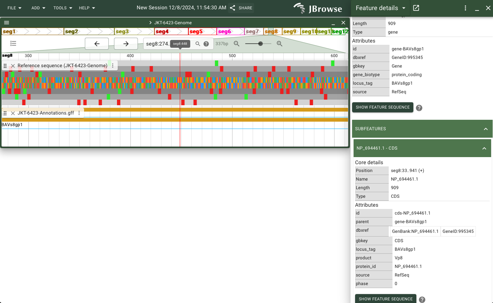
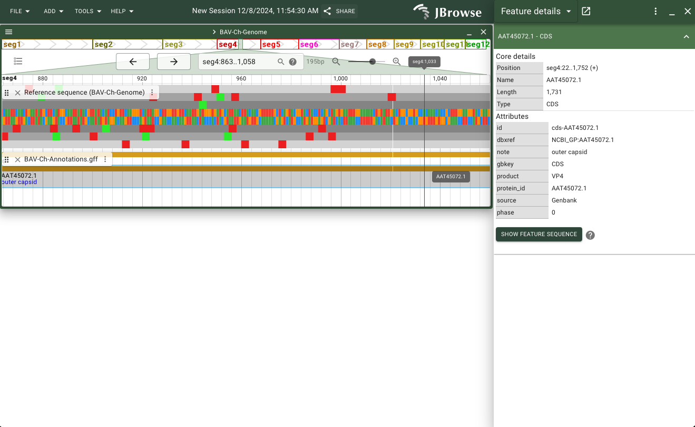
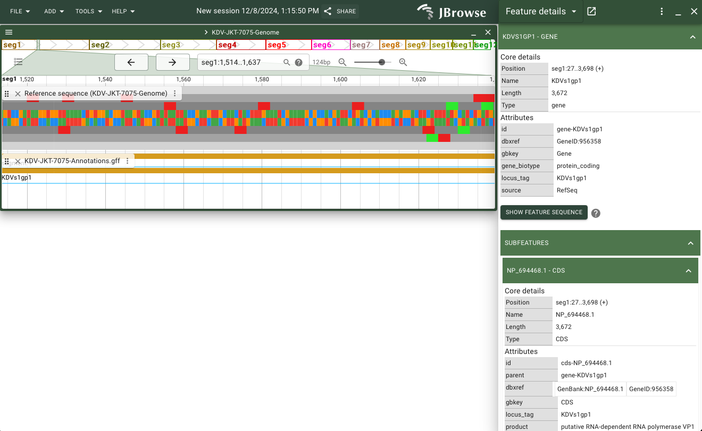

# Dataset Curation

Banna virus (BAV), classified under the genus Seadornavirus within the family Reoviridae, possesses a genome comprising 12 segments of double-stranded RNA (dsRNA), encoding a mix of structural and non-structural proteins. The total genome length is approximately 21 kb, with conserved terminal sequences that assist in genomic packaging and replication. First identified in Xishuangbanna, Yunnan Province, China, in 1987, BAV is transmitted by blood-sucking arthropods like mosquitoes, midges, and ticks. It infects a wide range of hosts, including humans, cattle, and swine, and has been associated with viral encephalitis and febrile illnesses. Its distribution spans Southeast Asia, with isolations from China, Vietnam, and Indonesia, highlighting its potential as a zoonotic pathogen.

Also included in this browser are select Banna-like viruses (one complete genome, several segments) also from the family Reoviridae.

**<ins>IMPORTANT NOTE:</ins>** Please install dependencies and set environment variables as described in the README (see "Installing a Local Copy of the Database") before running any of the shell scripts associated with these data.

### The Reference (and First Sequenced) Banna Virus Genome: JKT-6423

[Paper URL](https://pubmed.ncbi.nlm.nih.gov/10811934/) | [Dataset URL (JKT-6423 Banna virus)](https://www.ncbi.nlm.nih.gov/datasets/genome/GCF_000858185.1/)

NCBI RefSeq Assembly: GCF_000858185.1

GenBank Assembly: GCA_000858185.1

NCBI (RefSeq) Segment Accessions (in order): NC_004211.1, 	NC_004217.1, 	NC_004218.1, 	NC_004219.1, 	NC_004220.1, 	NC_004221.1,    NC_004204.1, 	NC_004203.1, 	NC_004202.1, 	NC_004201.1, 	NC_004200.1, 	NC_004198.1

To include this genome assembly in your copy of the database:
```bash
./scripts/jkt_6423.sh
```

The first Banna virus genome was sequenced in 2000 (H Attoui, et al.). ***#TODO: explanation***



***TODO: instructions to get to this view***

### Another Full Banna Virus Genome (Alternate Strain - BAV-Ch): 

[Paper URL](https://pubmed.ncbi.nlm.nih.gov/15784909/) | [Dataset URL (BAV-Ch)](https://www.ncbi.nlm.nih.gov/datasets/genome/GCA_023156985.1/)

GenBank Assembly: GCA_023156985.1

GenBank Segment Accessions (in order): 	AF168005.1, 	AF134526.1, 	AY549307.1, 	AY549308.1, 	AY549309.1, 	AF168006.1, 	AF052035.1, 	AF052034.1, 	AF052033.1, 	AF052032.1, 	AF052031.1, 	AF052030.1

To include this genome assembly in your copy of the database:
```bash
./scripts/bav-ch.sh
```

**Note:** The BAV-Ch assembly does not have complete .gff (or any other format) annotations. As a result, this script must separately download the .gff annotations for each virus segment and concatenate them into one genome-wide annotation file.

***#TODO: explanation***



***TODO: instructions to get to this view***

### Comparison to Kadipiro Virus

[Paper URL](https://pubmed.ncbi.nlm.nih.gov/10811934/) | [Dataset URL (KDV)](https://www.ncbi.nlm.nih.gov/datasets/genome/GCF_000851685.1/)

NCBI RefSeq Assembly: GCF_000851685.1

GenBank Assembly: GCA_000851685.1 (incomplete)

NCBI (RefSeq) Segment Accessions (in order): NC_004210.1, 	NC_004212.1, 	NC_004213.1, 	NC_004214.1, 	NC_004215.1, 	NC_004216.1, 	NC_004209.1, 	NC_004208.1, 	NC_004207.1, 	NC_004206.1, 	NC_004205.1, 	NC_004199.1

To include this genome assembly in your copy of the database:
```bash
./scripts/kdv_jkt_7075.sh
```

***#TODO: explanation***



***TODO: instructions to get to this view***

***#TODO: synteny view? some alignment view, at least***


### MSA Analysis of Most and Least Conserved Segments

[Paper URL](https://pmc.ncbi.nlm.nih.gov/articles/PMC10687475/) | [Dataset URL ()]()


### Vietnam/China virus clustering?

[Paper URL](https://pmc.ncbi.nlm.nih.gov/articles/PMC2600385/)


### Protein Structures

[Paper URL](https://pmc.ncbi.nlm.nih.gov/articles/PMC10687475/) | [Dataset URL ()]()

### Challenges and Future Work

***#TODO: complete lack of annotations for segments*** - future analysis with BLAST searches for similar virus proteins with real annotations, conserved protein domain study for better protein function information

### Citations (Papers/Datasets)

1. 
2. 

### Citations (Computational Tools)

1. Wei Shen*, Botond Sipos, and Liuyang Zhao. 2024. SeqKit2: A Swiss Army Knife for Sequence and Alignment Processing. iMeta e191. doi:10.1002/imt2.191
2. Li, H. (2018). Minimap2: pairwise alignment for nucleotide sequences. Bioinformatics, 34:3094-3100. doi:10.1093/bioinformatics/bty191

3. 

***#TODO: citations***
