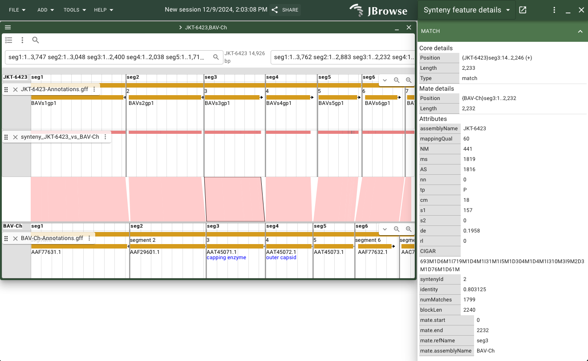
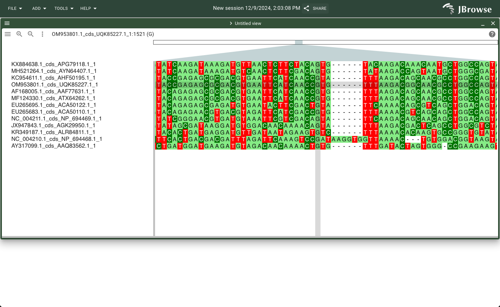
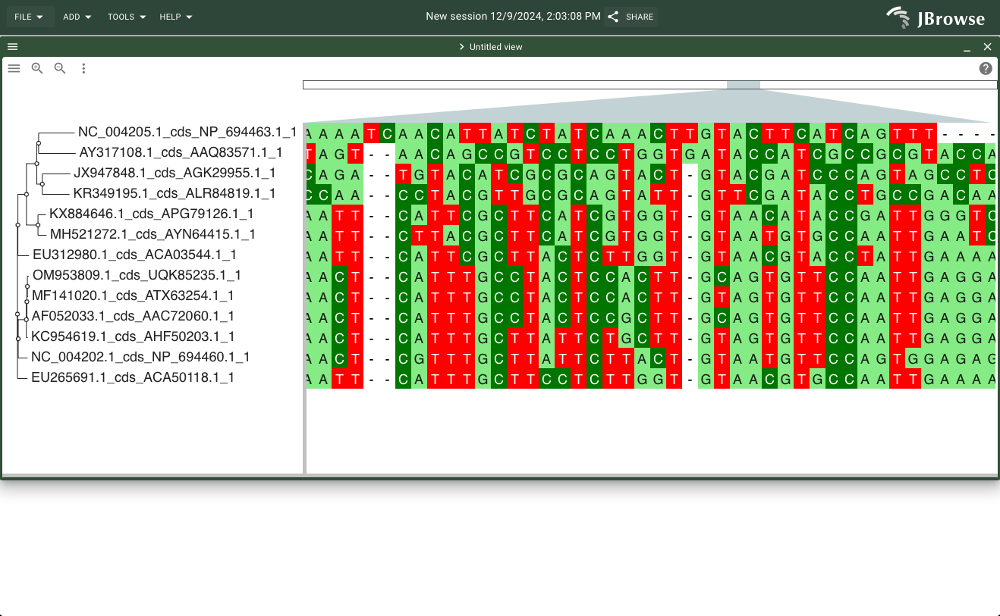
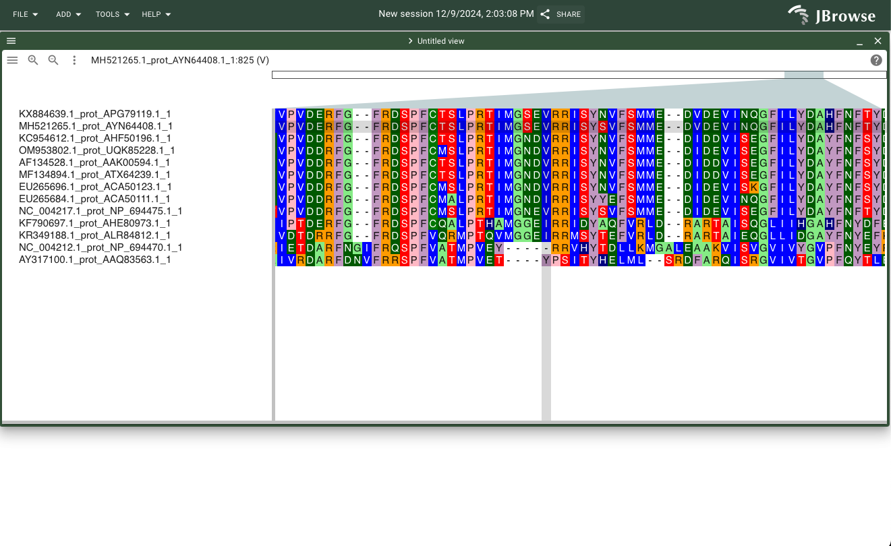
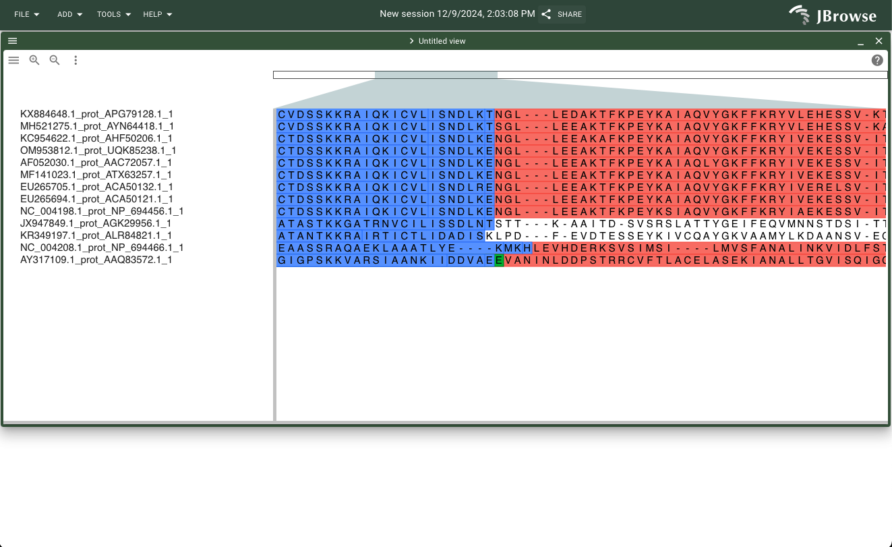

# Dataset Curation and Browser Views

Banna virus (BAV), classified under the genus Seadornavirus within the family Reoviridae, possesses a genome comprising 12 segments of double-stranded RNA (dsRNA), encoding a mix of structural and non-structural proteins. The total genome length is approximately 21 kb, with conserved terminal sequences that assist in genomic packaging and replication. First identified in Xishuangbanna, Yunnan Province, China, in 1987, BAV is transmitted by blood-sucking arthropods like mosquitoes, midges, and ticks. It infects a wide range of hosts, including humans, cattle, and swine, and has been associated with viral encephalitis and febrile illnesses. Its distribution spans Southeast Asia, with isolations from China, Vietnam, and Indonesia, highlighting its potential as a zoonotic pathogen.

This browser also includes select Banna-like viruses from the Reoviridae family. The reference genome of the Kadipiro virus (KDV) was incorporated due to its notable similarity to BAV. Indeed, the identification of these viral similarities led to the reclassification of both viruses into a new genus, Seadornavirus, within the Reoviridae family<sup>1</sup>. Additionally, specific viral segments (1, 2, 9, and 12) from 13 viruses (9 BAV and 4 BAV-like) are included, as outlined in `misc/our_msa.csv`. These segments were selected based on data availability and their representation as the most and least conserved genes across the viral strains studied<sup>3</sup>.

**NOTE:** The instructions below each view shown below are for local copies of the database, but to get to the same views in the web version, simply navigate to https://ibrah121.github.io/jbrowse2/, then follow the instructions as written. 

**<ins>IMPORTANT NOTE:</ins>** Please install dependencies and set environment variables as described in the README (see "Installing a Local Copy of the Database") before running any of the shell scripts associated with these data.

## The Reference (and First Sequenced) Banna Virus Genome: JKT-6423

Links: [Paper<sup>1</sup>](https://pubmed.ncbi.nlm.nih.gov/10811934/) | [Data](https://www.ncbi.nlm.nih.gov/datasets/genome/GCF_000858185.1/) (JKT-6423 BAV Genome Assembly)

NCBI RefSeq Assembly: GCF_000858185.1

GenBank Assembly: GCA_000858185.1

NCBI (RefSeq) Segment Accessions (in order): NC_004211.1, 	NC_004217.1, 	NC_004218.1, 	NC_004219.1, 	NC_004220.1, 	NC_004221.1,    NC_004204.1, 	NC_004203.1, 	NC_004202.1, 	NC_004201.1, 	NC_004200.1, 	NC_004198.1

To include this genome assembly in your copy of the database:
```bash
./scripts/jkt_6423.sh
```


*The BAV reference genome (JKT-6423), viewed using JBrowse2 in bav-browser.*

#### Navigation Instructions

To see a similar view in the bav-browser (local install), navigate to http://{your_localhost_url}/jbrowse2/ and click "Empty" under the header "Start a New Session". Ensure the view you are about to launch is the "Linear genome view", then click "Launch View". Select "JKT-6423" under the "Assembly" drop-down menu, and choose the segment that you want to view in the search bar and click "Open" (or alternatively, just press "Show All Regions in Assembly" to view all segments in one view).

## Another Full Banna Virus Genome (Alternate Strain - BAV-Ch): 

Links: [Paper<sup>2</sup>](https://pubmed.ncbi.nlm.nih.gov/15784909/) | [Data](https://www.ncbi.nlm.nih.gov/datasets/genome/GCA_023156985.1/) (BAV-Ch Genome Assembly)

GenBank Assembly: GCA_023156985.1

GenBank Segment Accessions (in order): 	AF168005.1, 	AF134526.1, 	AY549307.1, 	AY549308.1, 	AY549309.1, 	AF168006.1, 	AF052035.1, 	AF052034.1, 	AF052033.1, 	AF052032.1, 	AF052031.1, 	AF052030.1

To include this genome assembly in your copy of the database:
```bash
./scripts/bav-ch.sh
```

**Note:** The BAV-Ch assembly does not have complete .gff (or any other format) annotations. As a result, this script must separately download the .gff annotations for each viral segment and concatenate them into one genome-wide annotation file.


*An alternate strain of BAV (BAV-Ch), viewed using JBrowse2 in bav-browser.*

#### Navigation Instructions

To see a similar view in the bav-browser (local install), navigate to http://{your_localhost_url}/jbrowse2/ and click "Empty" under the header "Start a New Session". Ensure the view you are about to launch is the "Linear genome view", then click "Launch View". Select "BAV-Ch" under the "Assembly" drop-down menu, and choose the segment that you want to view in the search bar and click "Open" (or alternatively, just press "Show All Regions in Assembly" to view all segments in one view).

## BAV Virus Genome Comparison (Synteny View)

To include the data for the synteny view in your copy of the database:
```bash
./scripts/genomes_synteny.sh
```

**Note:** This script assumes you have already installed both previous viral genomes, so if you haven't yet done that, please do so!


*A comparison of viral alignment between two strains of BAV (JKT-6423 and BAV-Ch), viewed using JBrowse2 in bav-browser.*

#### Navigation Instructions

To see a similar view in the bav-browser (local install), navigate to http://{your_localhost_url}/jbrowse2/ and click "Empty" under the header "Start a New Session". Ensure the view you are about to launch is the "Linear synteny view", then click "Launch View". Select "JKT-6423" in the "Row 1 Assembly" drop-down menu, select "BAV-Ch" in the Row 2 Assembly drop-down menu, then click "Launch".

## Comparison to Kadipiro Virus

Links: [Paper<sup>1</sup>](https://pubmed.ncbi.nlm.nih.gov/10811934/) | [Data](https://www.ncbi.nlm.nih.gov/datasets/genome/GCF_000851685.1/) (KDV JKT-7075 Genome Assembly)

NCBI RefSeq Assembly: GCF_000851685.1

GenBank Assembly: GCA_000851685.1 (incomplete)

NCBI (RefSeq) Segment Accessions (in order): NC_004210.1, 	NC_004212.1, 	NC_004213.1, 	NC_004214.1, 	NC_004215.1, 	NC_004216.1, 	NC_004209.1, 	NC_004208.1, 	NC_004207.1, 	NC_004206.1, 	NC_004205.1, 	NC_004199.1

To include this genome assembly in your copy of the database:
```bash
./scripts/kdv_jkt_7075.sh
```


*An alternate strain of BAV (BAV-Ch), viewed using JBrowse2 in bav-browser.*

#### Navigation Instructions

To see a similar view in the bav-browser (local install), navigate to http://{your_localhost_url}/jbrowse2/ and click "Empty" under the header "Start a New Session". Ensure the view you are about to launch is the "Linear genome view", then click "Launch View". Select "KDV-JKT-7075" under the "Assembly" drop-down menu, and choose the segment that you want to view in the search bar and click "Open" (or alternatively, just press "Show All Regions in Assembly" to view all segments in one view).

Note: A deeper analysis of segment similarities between both BAV strains and KDV can be found in the next section.

## Genomic Conservation Across Strains and Species

Link: [Paper<sup>3</sup>](https://pmc.ncbi.nlm.nih.gov/articles/PMC10687475/)

The data used in this section was all sourced from [NCBI](https://www.ncbi.nlm.nih.gov/nuccore/), and the particular accession codes used can be found in `\misc\our_msa.csv`. In order to not hammer the NCBI database with 100+ requests per instance of this browser, all the data has been pre-retrieved and can be found at `data/non-programmatic/`.

All bioinformatics analysis done in the section was done with the [Clustal Omega tool](https://www.ebi.ac.uk/jdispatcher/msa/clustalo)<sup>7</sup>. To see how the original data files (individual segment nucleotide and protein FASTA files) were processed into a form usable by Clustal Omega, see `msa_data.sh`.

#### Navigation Instructions

For all views shown below, launch the MsaView plugin from the JBrowse homescreen (locally, http://{your_localhost_url}/jbrowse2/). From there, choose an appropriate MSA and/or tree file by clicking "File" then "Choose File" as described in the specific section.

### Nucleotide Sequence Conservation


*A multiple sequence alignment (MSA) for the segment 1 nucleotide sequences, viewed using JBrowse2 in bav-browser.*

#### Navigation Instructions

Select a nucleotide MSA alignment file from `analyses/clustal_omega/`, e.g. `analyses/clustal_omega/msa_seg1_nucleotide.aln-clustal_num`. Then, click "Open".

### Viral Clustering

Link: [Paper<sup>4</sup>](https://pmc.ncbi.nlm.nih.gov/articles/PMC2600385/)


*A multiple sequence alignment (MSA) for the segment 9 nucleotide sequences with a phylogenetic tree ordering/clustering, viewed using JBrowse2 in bav-browser.*

#### Navigation Instructions

Select both a nucleotide MSA alignment file from `analyses/clustal_omega/` and the corresponding pylogenetic tree file, e.g. for `analyses/clustal_omega/msa_seg1_nucleotide.aln-clustal_num`, also select `analyses/clustal_omega/phylo_seg1_nucleotide.phylotree`. Then, click "Open".

### Protein Sequence Conservation


*A multiple sequence alignment (MSA) for the segment 2 protein sequences, viewed using JBrowse2 in bav-browser.*

#### Navigation Instructions

Select a protein MSA alignment file from `analyses/clustal_omega/`, e.g. `analyses/clustal_omega/msa_seg1_protein.aln-clustal_num`. Optionally, also select the corresponding phylogenetic tree file, e.g. `analyses/clustal_omega/phylo_seg1_protein.phylotree`. Then, click "Open".

### Protein Domain Search


*A multiple sequence alignment (MSA) for the segment 12 protein sequences with protein domains shown, viewed using JBrowse2 in bav-browser.*

#### Navigation Instructions

Follow the instructions in the previous section, then click on the "hamburger" menu in the top left corner of the white section of the track. Hover over "Features/protein domains", then click "Query InterProScan for domains...". Running this step may take a few minutes.

## Challenges and Future Work

A significant challenge in the development of this browser came from the absence of comprehensive genome annotations for BAV segments. Notably, limited information exists regarding the functional roles of many BAV proteins beyond the identification of open reading frames (ORFs). This highlights an opportunity for the creation of more detailed annotations, including insights into protein functions, conserved domains, and other structural features. Future analyses could employ BLAST searches to identify homologous protein domains in better-characterized viral genomes, utilizing either existing annotations or well-established functional data.

## Citations

### Papers and Datasets:

1. Attoui H, Billoir F, Biagini P, de Micco P, de Lamballerie X. Complete sequence determination and genetic analysis of Banna virus and Kadipiro virus: proposal for assignment to a new genus (Seadornavirus) within the family Reoviridae. J Gen Virol. 2000 Jun;81(Pt 6):1507-15. doi: 10.1099/0022-1317-81-6-1507. PMID: 10811934.
2. Jaafar FM, Attoui H, Mertens PPC, de Micco P, de Lamballerie X. Structural organization of an encephalitic human isolate of Banna virus (genus Seadornavirus, family Reoviridae). J Gen Virol. 2005 Apr;86(Pt 4):1147-1157. doi: 10.1099/vir.0.80578-0. PMID: 15784909.
3. Yang Z, He Y, Chen Y, Meng J, Li N, Li S, Wang J. Full genome characterization and evolutionary analysis of Banna virus isolated from Culicoides, mosquitoes and ticks in Yunnan, China. Front Cell Infect Microbiol. 2023 Nov 16;13:1283580. doi: 10.3389/fcimb.2023.1283580. PMID: 38035340; PMCID: PMC10687475.
4. Nabeshima T, Thi Nga P, Guillermo P, Parquet Mdel C, Yu F, Thanh Thuy N, Minh Trang B, Tran Hien N, Sinh Nam V, Inoue S, Hasebe F, Morita K. Isolation and molecular characterization of Banna virus from mosquitoes, Vietnam. Emerg Infect Dis. 2008 Aug;14(8):1276-9. doi: 10.3201/eid1408.080100. PMID: 18680655; PMCID: PMC2600385.

### Computational Tools:

5. Wei Shen*, Botond Sipos, and Liuyang Zhao. 2024. SeqKit2: A Swiss Army Knife for Sequence and Alignment Processing. iMeta e191. doi:10.1002/imt2.191
6. Li, H. (2018). Minimap2: pairwise alignment for nucleotide sequences. Bioinformatics, 34:3094-3100. doi:10.1093/bioinformatics/bty191
7. Sievers F, Wilm A, Dineen D, Gibson TJ, Karplus K, Li W, Lopez R, McWilliam H, Remmert M, Söding J, Thompson JD, Higgins DG. Fast, scalable generation of high-quality protein multiple sequence alignments using Clustal Omega. Mol Syst Biol. 2011 Oct 11;7:539. doi: 10.1038/msb.2011.75. PMID: 21988835; PMCID: PMC3261699.
8. Mirdita, M., Schütze, K., Moriwaki, Y. et al. ColabFold: making protein folding accessible to all. Nat Methods 19, 679–682 (2022). https://doi.org/10.1038/s41592-022-01488-1
9. Jumper, J., Evans, R., Pritzel, A. et al. Highly accurate protein structure prediction with AlphaFold. Nature 596, 583–589 (2021). https://doi.org/10.1038/s41586-021-03819-2
